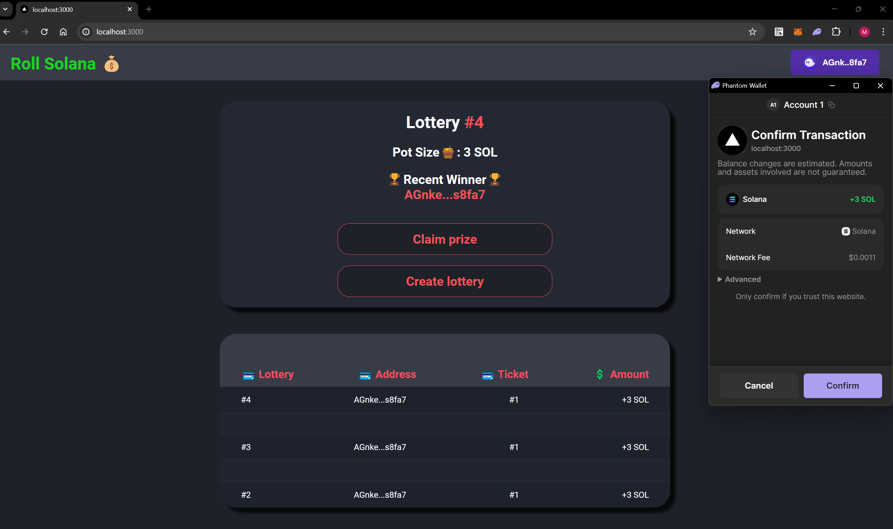

# Solana Lottery App

## Overview
This repository contains the source code for a decentralized lottery application built on the Solana blockchain using the Anchor framework in Rust. The lottery smart contract is deployed on the Solana network, allowing users to participate in a transparent and fair lottery directly from their Solana wallets.

## Features
- **Decentralized:** The lottery is executed entirely on the Solana blockchain, ensuring transparency and fairness.
- **Immutable:** Lottery rules and outcomes are stored on the blockchain, providing an immutable record of the lottery's history.
- **Trustless:** Users can participate in the lottery without relying on a central authority, thanks to smart contracts.
- **Efficient:** Built on Solana, the lottery app benefits from its high throughput and low transaction fees.

## Getting Started
To get started with the lottery app, follow these steps:

1. **Clone the Repository:**

cd solana-lottery-app

2. **Install Dependencies:**
Ensure that you have Rust and the Solana tool suite installed. You can find installation instructions on the [official Solana documentation](https://docs.solana.com/cli/install-solana-cli-tools).

3. **Build and Deploy:**
Build the smart contract and deploy it to the Solana network.

anchor build
anchor deploy

4. **Run the Client:**
Run the client application to interact with the deployed lottery smart contract.

cd client
cargo run

## Usage
Once the client application is running, users can participate in the lottery by following the prompts. They can buy tickets, check their ticket status, and view the current lottery jackpot.

## Contributing
Contributions to the Solana lottery app are welcome! If you find a bug or have an idea for an improvement, please open an issue or submit a pull request.

## License
This project is licensed under the [MIT License](LICENSE).

## Acknowledgments
- [Solana Documentation](https://docs.solana.com/): Official documentation for the Solana blockchain.
- [Anchor](https://project-serum.github.io/anchor/): A framework for building Solana smart contracts in Rust.
- [Rust Programming Language](https://www.rust-lang.org/): The programming language used for building the lottery smart contract.
